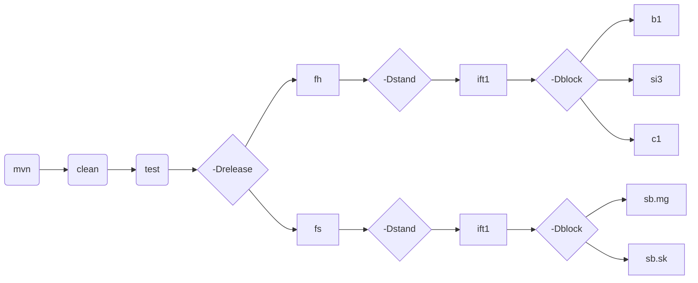

```mermaid 
flowchart LR
    A(mvn) --> B(clean)
    B --> C(test)
    C --> D{-Drelease}
    D --> E[fh]
    D --> F[fs]
    E --> G{-Dstand}
    F --> H{-Dstand}
    G --> J[ift1]
    H --> K[ift1]
    J --> I{-Dblock}
    K --> L{-Dblock}
    L --> M[sb.mg]
    L --> N[sb.sk]
    I --> O[b1]
    I --> P[si3]
    I --> R[c1]
```
